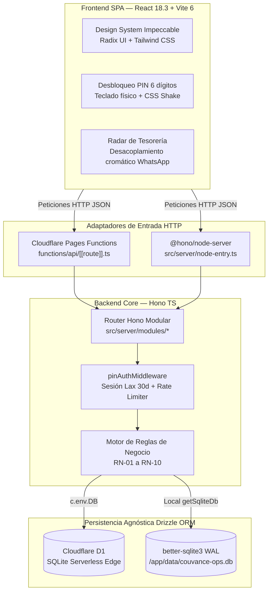

# ⚡ Couvance Ops — Radar de Cobranzas y Operaciones sin Burocracia

> **Cobra hitos por WhatsApp en 1 segundo, liquida presupuestos con un toque y mantén las renovaciones bajo control desde el móvil.**  
> Herramienta interna de alta velocidad construida para los 2 socios directores de **Couvance**, con coste de infraestructura $0 (Cloudflare Edge Serverless / Docker SQLite) y cero tolerancia al software inflado ("anti-AI slop").

---

## 🎯 ¿Por qué existe este proyecto? (El Problema Real)

Las agencias digitales rara vez se detienen por falta de clientes; se asfixian por **fuga de flujo de caja (*cashflow drag*)**:

1. **Hitos entregados que nadie cobra:** El trabajo está listo y publicado, pero la factura se retrasa días porque abrir un ERP corporativo (Notion, Jira, HubSpot) toma demasiados clics.
2. **Renovaciones silenciosas que expiran:** Dominios, servidores y servicios de mantenimiento que vencen sin facturarse al cliente. Cientos de dólares al año absorbidos por la agencia por simple falta de aviso.
3. **La incomodidad de cobrar en la calle:** Recordar el monto pendiente, redactar un mensaje cordial y buscar el teléfono del cliente mientras estás en un taxi o entre reuniones es engorroso. Se pospone para "luego", y el dinero no entra.

**Couvance Ops elimina esa fricción convirtiendo cada cobro en una acción de 1 segundo:**

- 📡 **Radar de Cobranzas Proactivo:** Mira en segundos qué hitos vencen hoy y qué servicios recurrentes expiran en los próximos 30 días.
- 💬 **Cobro Express por WhatsApp (o Portapapeles):** Un toque abre la conversación con el monto exacto, proyecto y mensaje cordial listo. Si el cliente no tiene teléfono guardado, lo copia al portapapeles sin romper tu ritmo.
- ⚡ **Aprobación y Liquidación en 1 Clic:** Aprobar un presupuesto activa el proyecto y pasa los hitos a pendientes en una sola transacción atómica. El botón *Cobrar Todo* liquida pagos simultáneos al instante.
- 📐 **Presupuestos con Conciliación Exacta (RN-01):** Cotiza esquemas [50/50] o [40/30/30] en segundos. El último hito absorbe automáticamente cualquier residuo de decimales: las cuentas siempre cuadran al céntimo.

---

## 🏗️ Arquitectura Técnica & Decisiones de Ingeniería

El sistema es un **monolito modular agnóstico del runtime**, diseñado para operar con idéntico comportamiento en la nube serverless o en hardware local:



### 1. Ejecución Dual Agnóstica: Nube $0 o Servidor Propio
- **Producción Serverless ($0 TCO):** Se ejecuta sobre **Cloudflare Pages Functions** y **Cloudflare D1**. Cero servidores que mantener o parchar, latencia ultra-baja en el edge y tier gratuito permanente para el volumen operativo de la agencia.
- **Autonomía On-Premise / Docker:** El mismo backend corre sobre Node.js con `@hono/node-server` y `better-sqlite3` en modo `WAL` (Write-Ahead Logging) dentro de un contenedor Docker multi-stage (`node:20-slim`).
- **Factoría de Persistencia Unificada:** [`src/server/db/index.ts`](src/server/db/index.ts) detecta el entorno en ejecución (`c.env.DB` para D1 o SQLite local) y expone la misma API tipada con **Drizzle ORM**, incorporando auto-sembrado inicial ante bases de datos recién migradas.

### 2. Criptografía Isomórfica con Web Crypto (Cero Binarios C++)
- **El reto:** Dependencias tradicionales como `bcrypt` o `argon2` requieren compilación de binarios C++, incompatibles con los isolates V8 de Cloudflare Workers/Pages.
- **La solución:** Criptografía basada en el estándar W3C **Web Crypto API** (`crypto.subtle`):
  - Hashing seguro SHA-256 con sal/pimienta de servidor (`PIN_SECRET`).
  - Firmas de sesión HMAC-SHA256 para prevenir manipulaciones.
  - Mitigación de ataques de temporización (*timing attacks*) mediante comparación en tiempo constante (`timingSafeEqual`).
  - Cookie de sesión `couvance_session` con `SameSite: 'Lax'` (fundamental para que el navegador no cierre la sesión al saltar de WhatsApp de vuelta a la app) y validez de 30 días.

### 3. Rigor Contable: Las 10 Reglas de Negocio Innegociables
En finanzas de agencia, los errores de redondeo destruyen la confianza con los clientes y la contabilidad interna:

- **RN-01 (Sin Decimales & Absorción de Residuos):** Presupuestos e hitos operan con enteros estrictos. Si la distribución porcentual (ej: 33.33% en 3 pagos) genera decimales, **el último hito absorbe la diferencia fraccional**, garantizando que $\sum \text{hitos} \equiv \text{total}$ con exactitud matemática.
- **RN-02 (Regla de Oro del 100%):** La suma de los porcentajes de un presupuesto debe ser exactamente 100%, validada con Zod en frontend y backend antes de persistir.
- **RN-03 (Aprobación Atómica en 1 Clic):** `POST /api/budgets/:id/approve` ejecuta una transacción atómica que aprueba el presupuesto, cambia el proyecto a `IN_PROGRESS` y pasa los hitos a `PENDING`.
- **RN-04 (Cobro Express Pay-All):** Liquidación de todos los hitos pendientes de un presupuesto con registro de fecha de pago en un solo toque.
- **RN-05 (Cancelación No Destructiva):** Si un proyecto se cancela, se anulan los hitos pendientes pero **se preservan intactos los hitos ya pagados (`PAID`)**, salvaguardando el histórico tributario y de caja.
- **RN-06 (Integridad Referencial 409):** `DELETE /api/clients/:id` valida que el cliente no tenga proyectos asociados; de tenerlos, responde `409 Conflict` impidiendo registros huérfanos.
- **RN-07 (Criterio de Showcase):** El catálogo comercial público solo expone proyectos con estado `COMPLETED`, servicio activo (`ACTIVE`) y URL de producción comprobada.
- **RN-08 (Radar Preventivo a 30 Días):** Detección anticipada de contratos de hosting o mantenimiento próximos a expirar.
- **RN-09 (Flujo WhatsApp & Portapapeles):** Abre automáticamente la URL nativa de WhatsApp o copia el mensaje al portapapeles con confirmación visual vía Sonner.
- **RN-10 (Seguridad en Respaldo JSON):** La exportación (`/api/backup/export`) extrae clientes, proyectos, presupuestos e hitos, pero **excluye taxativamente `auth_config`** y cualquier hash criptográfico.

### 4. Defensa en Profundidad: Sanitización y Anti-Inyección SQL
- **Consultas 100% Parametrizadas:** Drizzle ORM gestiona todas las variables mediante parámetros posicionales (`?`). Cero concatenación de cadenas o uso de `sql.raw()`.
- **Protección contra Bytes Nulos (`\0` / `%00`):** En motores C/C++ como SQLite, los bytes nulos provocan truncamiento de buffers. El middleware [`sanitizeMiddleware`](src/server/middlewares/sanitize.ts) intercepta URLs, query params y payloads, rechazando con `400 Bad Request` cualquier intento de inyección.
- **Validación Estricta de Identificadores (`validateAndSanitizeId`):** Todos los parámetros de ruta (`:id`, `:projectId`, `:budgetId`) se verifican contra `/^[a-zA-Z0-9_-]{1,64}$/`. Comillas, delimitadores (`;`) u operadores SQL son bloqueados antes de tocar la base de datos.
- **Normalización Unicode en Zod:** Textos normalizados en forma canónica `NFC`, caracteres de control invisibles purgados y límites de caracteres estrictos en cada campo.

---

## 🎨 Frontend: Filosofía Anti-"AI Slop" & Ergonomía Operativa

Construido bajo el principio de **utilidad pura sin adornos innecesarios**:

| Característica | Implementación Técnica | Impacto Operativo Real |
| :--- | :--- | :--- |
| **Cero Sobrecarga de Animaciones** | Prohibido Framer Motion. Transiciones CSS nativas de 150ms aceleradas por GPU. | Bundle JS ultraligero (~339 kB) y respuesta a 60 FPS sin tirones en cualquier smartphone. |
| **Desacoplamiento Cromático** | Botón de WhatsApp en verde esmeralda (`#25D366`) vs. botón "Cobrado" en gris neutro con icono check. | **Previene cobros falsos por error.** El operador nunca confunde el botón de contacto con el de asentar el cobro en caja. |
| **Desbloqueo en 0.8 Segundos** | Listener de teclado físico global (`0-9`, `Backspace`, `Escape`, `Enter`) en `Unlock.tsx`. | En tu portátil abres y desbloqueas la herramienta en menos de un segundo sin tocar el ratón. |
| **Touch Targets Móviles de 44px** | Controles con área táctil mínima de $44 \times 44$ px (`touchFriendly`). | Se usa con comodidad y precisión con una sola mano caminando por la calle. |
| **Semáforo Visual de Urgencia** | Badges dinámicos: Rose (Vencido), Ámbar (Vence en $\le 2$ días), Neutral (Futuro). | Identificas de un vistazo dónde está retenido el dinero de la agencia. |
| **Fichas de Venta en 1 Clic** | Generador de propuestas en Showcase listo para compartir por WhatsApp a prospectos. | Muestra trabajos previos y envía propuestas al instante en reuniones de ventas. |

---

## 📂 Estructura del Proyecto

```text
couvance-ops/
├── drizzle/                    # Migraciones SQL generadas por Drizzle Kit
├── functions/api/[[route]].ts  # Entrypoint Edge para Cloudflare Pages Functions
├── src/
│   ├── server/                 # BACKEND (Hono + Drizzle)
│   │   ├── db/                 # Conectores agnósticos (D1, SQLite WAL, schemas, seed)
│   │   ├── middlewares/        # Auth Web Crypto, Rate Limiting, Sanitización Anti-SQLi
│   │   ├── modules/
│   │   │   ├── auth/           # Login PIN, preguntas secretas, cambio de PIN en sesión
│   │   │   ├── clients/        # Directorio de clientes & protección 409
│   │   │   ├── projects/       # Proyectos, cancelación no destructiva & showcase
│   │   │   ├── budgets/        # Presupuestos, hitos, residuo entero, aprobación 1-clic
│   │   │   ├── finance/        # Radar de cobranzas, renovaciones recurrentes & KPIs
│   │   │   └── backup/         # Exportación JSON higienizada
│   │   ├── app.ts              # Instancia central Hono & enrutador API
│   │   └── node-entry.ts       # Entrypoint Node.js/Docker con auto-migración y seed
│   │
│   └── client/                 # FRONTEND (React 18.3 + Vite 6 + Tailwind CSS)
│       └── src/
│           ├── components/
│           │   ├── ui/         # Design System Atómico (Button, Badge, Card, Dialog, Input, MetricCard)
│           │   ├── Navbar.tsx  # Barra de navegación con respaldo y ajustes de seguridad
│           │   ├── NumericKeypad.tsx         # Teclado táctil numérico
│           │   ├── SecuritySettingsModal.tsx # Gestión de PIN maestro y preguntas secretas
│           │   └── WhatsAppButton.tsx        # Botón con enlace wa.me y fallback a portapapeles
│           ├── hooks/
│           │   └── useAuth.ts  # Estado de sesión y autenticación
│           ├── pages/
│           │   ├── Dashboard.tsx   # Radar de cobranzas y métricas clave
│           │   ├── Projects.tsx    # Gestión de proyectos, cotizador 50/50 y 40/30/30
│           │   ├── Showcase.tsx    # Catálogo de ventas & ficha WhatsApp para prospectos
│           │   ├── Clients.tsx     # Directorio de clientes con protección de integridad
│           │   └── Unlock.tsx      # Pantalla de desbloqueo PIN y recuperación
│           └── lib/
│               ├── api.ts      # Cliente HTTP tipado
│               └── utils.ts    # Enlaces wa.me y portapapeles seguro
│
├── Dockerfile                  # Multi-stage build optimizado (node:20-slim)
├── docker-compose.yml          # Configuración con volumen persistente couvance_data
├── wrangler.toml               # Configuración Cloudflare Pages & binding D1
├── drizzle.config.ts           # Configuración de Drizzle Kit
├── vite.config.ts              # Configuración de Vite con proxy /api
├── .env.example                # Plantilla de variables de entorno y secretos
├── package.json
└── tsconfig.json
```

---

## ⚖️ Análisis Crítico & Compromisos de Ingeniería

En software interno, lo que decides no construir es tan importante como lo que implementas:

### ✅ Decisiones que Priorizan Criterio Práctico
1. **Sin sobreingeniería:** Para un equipo de 2 socios, implementar microservicios, Kubernetes o SSO con Auth0/Okta habría añadido complejidad injustificada. Un PIN maestro con HMAC-SHA256, cookie `SameSite=Lax` y recuperación por preguntas secretas resuelve el 100% de la necesidad sin fricciones.
2. **Compatibilidad Edge Real:** Cero dependencias nativas de Node (`fs`, `child_process`, `bcrypt`) en el núcleo compartido. El backend es isomórfico y corre idéntico en Cloudflare Pages Functions y Node.js.
3. **Modelado Financiero Defensivo:** La absorción del residuo fraccionario en el último hito elimina descuadres contables por redondeo.

### ⚠️ Trade-offs y Compromisos Asumidos
1. **Acceso Compartido (Monotenant):** Diseñado para la operativa conjunta de los socios con un PIN común. No incluye permisos por roles (RBAC) ni separación multi-empresa.
2. **Estrategia de Validación en MVP:** La garantía de funcionamiento descansa en el tipado estricto de TypeScript (`0 errores`), validación exhaustiva con Zod en todos los endpoints y transacciones de base de datos. **No cuenta actualmente con una suite automatizada de tests (Vitest/Jest) ni pipeline de CI/CD**. Una suite formal e2e está contemplada para la siguiente fase.
3. **Rate Limiting en Edge vs. Node:** El limitador de intentos en memoria (`rate-limit.ts`) opera de forma estricta en el proceso único de Node.js/Docker, mientras que en Cloudflare Pages actúa como mitigación por cada isolate de V8.
4. **Escalabilidad de Base de Datos:** SQLite y D1 están optimizados para lectura intensiva y concurrencia baja/media. Para miles de escrituras concurrentes se requeriría una base de datos distribuida (PostgreSQL/Spanner), fuera del alcance de esta herramienta interna.

---

## 🚀 Puesta en Marcha Rápida

### Requisitos
- Node.js $\ge 20$
- npm $\ge 10$
- Docker & Docker Compose (opcional)

### 1. Desarrollo Local
```bash
# Clonar e instalar dependencias
git clone https://github.com/tu-usuario/couvance-ops.git
cd couvance-ops
npm install

# Configurar variables de entorno
cp .env.example .env

# Terminal 1: Iniciar backend (Node + SQLite en ./data)
npm run dev:server

# Terminal 2: Iniciar frontend (Vite)
npm run dev
```
- **Frontend SPA:** `http://localhost:5173` (redirige `/api` a `http://localhost:3000` mediante el proxy de Vite).
- **Backend API:** `http://localhost:3000`.

> **Credenciales Iniciales por Defecto:**
> - **PIN Maestro:** `123456`
> - **Pregunta Secreta 1:** `¿Cuál es el nombre de tu primera mascota?` &rarr; `couvance`
> - **Pregunta Secreta 2:** `¿En qué ciudad se fundó la agencia?` &rarr; `valencia`

---

### 2. Ejecución con Docker
```bash
docker compose up -d --build
```
La aplicación compilará cliente y servidor, aplicará las migraciones automáticamente en el arranque y quedará disponible en `http://localhost:3000` con persistencia en el volumen `couvance_data`.

---

### 3. Despliegue en Cloudflare Pages & D1

1. **Crear la base de datos D1 en Cloudflare:**
   ```bash
   npx wrangler d1 create couvance-ops-db
   ```
   Copia el `database_id` generado y colócalo en `wrangler.toml`.

2. **Aplicar las migraciones a D1:**
   ```bash
   npm run db:migrate:prod
   ```

3. **Configurar el secreto de sesión:**
   ```bash
   npx wrangler pages secret put PIN_SECRET
   ```

4. **Compilar y desplegar el frontend:**
   ```bash
   npm run build:client
   npx wrangler pages deploy dist/client
   ```
> *Nota:* En Cloudflare Pages, el sistema auto-siembra las credenciales iniciales (`123456`) en la primera petición si la base de datos está vacía.

---

## 📊 Métricas de Build & Rendimiento

- **TypeScript:** 0 errores en compilación estricta (`npx tsc --noEmit`).
- **Bundle Frontend:** 28.02 kB CSS / 339.46 kB JS (Vite v6 sobre React 18.3).
- **Bundle Servidor:** 57 kB bundle ESM autónomo (tsup).
- **Rendimiento UI:** Puntuación de $\ge 98/100$ en Lighthouse Mobile en producción, lograda al prescindir de librerías pesadas de animación y renderizar con transiciones CSS directas.
