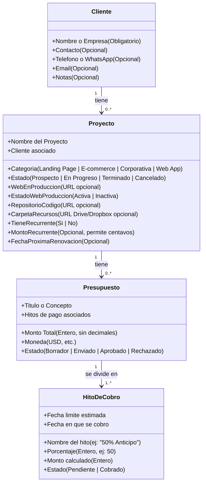

# 📋 Couvance Ops — Especificación Funcional & Alcance del MVP

> **Documento de Definición de Producto:** Especificación simplificada, ágil y agnóstica de tecnología para el MVP de uso personal e interno de **Couvance Ops** (herramienta operativa para 2 personas).

---

## 🎯 1. Visión y Propósito del MVP

### 1.1 Contexto Real
**Couvance Ops** nace como una herramienta interna y personal para los **2 socios/operadores** de la agencia digital (Couvance). No busca ser un software corporativo con burocracia administrativa, sino una solución ligera y directa para reemplazar notas dispersas, chats de WhatsApp y hojas de cálculo desactualizadas.

### 1.2 Objetivo Central
Tener en un solo lugar y en tiempo real la respuesta a 4 necesidades fundamentales del día a día:
1. **Control de Proyectos y Clientes:** Saber qué trabajos están activos y tener a mano los accesos clave de cada desarrollo.
2. **Presupuestación Ágil:** Confeccionar cotizaciones en segundos usando esquemas de cobro predefinidos.
3. **Control del Flujo de Caja y Cobranza:** Saber con exactitud qué hitos están pendientes, cobrar con 1 clic por WhatsApp y monitorear renovaciones de hosting/mantenimiento.
4. **Repositorio de Proyectos (Showcase de Ventas):** Catálogo centralizado de webs terminadas para filtrar por tipo y enviar muestras a prospectos comerciales al instante.

### 1.3 Filosofía del MVP: Máxima Agilidad y Cero Fricción
* **Acceso Ágil mediante PIN de 6 dígitos:** Sin registro de usuarios, correos ni contraseñas complejas. Se ingresa el PIN una sola vez en el dispositivo y queda recordado.
* **Sin validaciones fiscales ni datos obligatorios innecesarios:** Un cliente se registra rápidamente solo con su nombre o empresa, sin exigir identificación tributaria ni correos únicos.
* **Cobranza directa:** La comunicación con el cliente se realiza aprovechando enlaces directos de WhatsApp (`wa.me`) y resúmenes copiables con un clic, sin complejas integraciones de pasarelas ni servidores externos.

---

## 🏢 2. Entidades de Información (Modelo Esencial)

---

## ⚙️ 3. Requerimientos No Funcionales (RNF)

Definidos bajo la realidad operativa de los 2 socios:

* **RNF-01 (Disponibilidad y Movilidad Web):** La herramienta debe operar como una aplicación web accesible remotamente desde cualquier dispositivo (computadora de escritorio, laptop o smartphone). La interfaz debe ser 100% responsiva para permitir registrar cobros y enviar mensajes de WhatsApp directamente desde el celular en la calle.
* **RNF-02 (Concurrencia Pragmática — Last Write Wins):** Si ambos socios editan un mismo proyecto o cliente simultáneamente, el último guardado prevalece (*Last Write Wins*). No se requieren bloqueos complejos de registros.
* **RNF-03 (Integridad y Respaldo Exportable):** Debe existir un botón directo de **"Exportar / Descargar Respaldo"** que permita a los socios descargar en 1 clic un archivo con toda la información (clientes, proyectos, cobros, enlaces) para guardarlo localmente o en la nube de forma semanal.
* **RNF-04 (Rendimiento Instantáneo):** Al ser una herramienta de uso interno con volumen controlado de datos, las transiciones entre pantallas, filtros y cálculos de saldos deben responder de manera prácticamente instantánea (tiempo de respuesta inferior a 1 segundo).
* **RNF-05 (Seguridad sin Cuentas — PIN de 6 Dígitos):** 
  * Acceso protegido mediante una URL privada y un teclado numérico para ingresar un **PIN maestro de 6 dígitos**.
  * Al introducirse correctamente, el navegador recuerda el dispositivo para no solicitarlo en cada recarga.
  * En caso de olvido o fallo del PIN, el sistema ofrece un mecanismo de recuperación mediante **2 preguntas de seguridad secretas** predefinidas exclusivamente por los dos socios.

---

## 🗺️ 4. Casos de Uso y Flujos de Usuario

### CU-01: Acceso al Sistema mediante PIN
* **Actor:** Cualquiera de los 2 socios.
* **Flujo Principal:**
  1. El usuario abre la URL de Couvance Ops.
  2. Si el dispositivo no está recordado, se presenta la pantalla con teclado numérico para ingresar el PIN de 6 dígitos.
  3. Al validar el PIN, entra de inmediato al panel principal y el dispositivo queda recordado.
* **Flujo Alterno (Recuperación):** Si no recuerda el PIN, pulsa "¿Olvidaste el PIN?", responde correctamente las 2 preguntas de seguridad y el sistema le permite configurar un nuevo PIN de 6 dígitos.

### CU-02: Alta Rápida de Cliente y Proyecto
* **Actor:** Socio gestor.
* **Flujo:**
  1. Ingresa nombre o empresa del cliente (teléfono y email si los tiene a mano).
  2. Crea el proyecto asociado, define su categoría (`Landing Page`, `E-commerce`, etc.) y pega el enlace a la Carpeta de Recursos en Google Drive/Dropbox si ya fue creada.
  3. El proyecto queda registrado en estado `Prospecto`.

### CU-03: Cotización con Presets y Aprobación
* **Actor:** Socio gestor.
* **Flujo:**
  1. Abre el proyecto y crea una cotización ingresando el monto total (número entero, ej: $1,200).
  2. Elige un preset de cobro: **[50 / 50]** o **[40 / 30 / 30]**. Los hitos se generan automáticamente garantizando el 100%.
  3. Pulsa "Copiar Resumen para el Cliente" y lo pega en WhatsApp.
  4. Cuando el cliente acepta, pulsa **"Aprobar Presupuesto"**:
     - El presupuesto pasa a `Aprobado`.
     - El proyecto pasa a `En Progreso`.
     - Se crean los hitos de cobro en estado `Pendiente`.

### CU-04: Cobranza por WhatsApp y Detección de Teléfono
* **Actor:** Cualquiera de los 2 socios.
* **Flujo con Teléfono:**
  1. Desde el radar de cobros, pulsa el botón verde "Cobrar por WhatsApp" junto al hito pendiente.
  2. Se abre automáticamente WhatsApp con el chat del cliente y el mensaje cordial pre-redactado con el concepto, monto y proyecto.
* **Flujo sin Teléfono (Fallback):**
  1. Si el cliente no tiene teléfono registrado, al pulsar el botón el sistema copia automáticamente el texto del mensaje al portapapeles.
  2. Muestra un aviso en pantalla: *"El cliente no tiene teléfono guardado. El mensaje fue copiado al portapapeles para que lo pegues donde prefieras"*.

### CU-05: Cobro Express ("Cobrar Todo") e Hitos Individuales
* **Actor:** Socio que recibe el pago.
* **Flujo Individual:** El cliente transfiere un hito parcial &rarr; el socio toca "Cobrado" en dicho hito, se registra la fecha actual y el saldo del proyecto se reduce.
* **Flujo "Cobrar Todo":** Si el cliente transfiere la totalidad del proyecto en un solo pago &rarr; el socio pulsa **"Cobrar Todo"**: todos los hitos pendientes se marcan como `Cobrados` con la fecha actual en un solo paso y el saldo pendiente pasa a $0.

### CU-06: Entrega, Repositorio y Showcase
* **Actor:** Socio desarrollador.
* **Flujo:**
  1. Al finalizar la web, entra a la ficha del proyecto y añade la **URL de Producción** y el **Repositorio de Código** (GitHub/GitLab).
  2. Cambia el estado del proyecto a `Terminado`.
  3. Automáticamente el proyecto se suma al **Showcase de Ventas**, disponible para ser filtrado por categoría cuando un nuevo prospecto solicite referencias.

### CU-07: Cancelación con Preservación Histórica
* **Actor:** Socio gestor.
* **Flujo:**
  1. Si un cliente desiste del proyecto tras haber pagado el anticipo, el proyecto se marca como `Cancelado`.
  2. En la interfaz se muestra visualmente tachado.
  3. Los cobros ya realizados se conservan en las métricas de dinero cobrado de la agencia (no se borra el anticipo).
  4. Los hitos que estaban pendientes se anulan y ya no aparecen en el radar de cobros activos.

---

## ⚖️ 5. Reglas de Negocio Indispensables

* **RN-01 (Sin Decimales en Presupuestos y Reconciliación de Residuo):** Los porcentajes de los hitos y los montos de presupuestos principales deben ser números enteros (sin centavos, ej: 50%, $1,500 USD). En presupuestos donde el cálculo porcentual arroje fracciones (ej: 30% de $1,005 = $301.50), los hitos iniciales se redondean a enteros (`Math.floor` o `Math.round`) y el último hito absorbe automáticamente la diferencia para que la suma total coincida exactamente con el monto presupuestado. Únicamente los montos de servicios recurrentes (hosting, dominios, mantenimiento) pueden admitir centavos si el proveedor externo maneja tarifas con decimales (ej: $9.99 USD/mes).
* **RN-02 (Regla de Oro del 100%):** La suma de los porcentajes enteros de los hitos debe ser exactamente 100%. Ningún presupuesto puede guardarse ni aprobarse con sumas distintas.
* **RN-03 (Aprobación Atómica en 1 Clic):** Aprobar un presupuesto cambia el estado a `Aprobado`, cambia el proyecto a `En Progreso` y crea los hitos de cobro en estado `Pendiente`.
* **RN-04 (Operación Cobrar Todo):** Permite liquidar todos los hitos pendientes de un presupuesto aprobado en una sola acción registrando la fecha actual.
* **RN-05 (Cancelación No Destructiva):** Un proyecto cancelado nunca se elimina de la base de datos; queda tachado pero conserva el historial de pagos recibidos.
* **RN-06 (Elegibilidad de Showcase):** Solo los proyectos en estado `Terminado` se visualizan en el Showcase de ventas.
* **RN-07 (Estado de Enlaces - Web Inactiva):** Los proyectos terminados permiten alternar el estado de su web en producción entre `Activa` e `Inactiva`. Las webs inactivas se ocultan o se señalan en el Showcase para no enviar enlaces caídos a prospectos.
* **RN-08 (Alerta Preventiva de Recurrentes a 30 Días):** Todo proyecto con servicio recurrente activo muestra una alerta visual cuando falten 30 días o menos para su fecha de renovación.

---

## 🛡️ 6. Casos Límite y Gestión de Fallos

| Caso Límite / Escenario de Fallo | Comportamiento del Sistema | Solución / Recuperación |
| :--- | :--- | :--- |
| **Cliente sin teléfono al cobrar por WhatsApp** | Detecta la ausencia de número telefónico. | No abre enlace roto; copia automáticamente el mensaje redactado al portapapeles y notifica al usuario con un aviso flotante. |
| **Cliente paga la totalidad del proyecto de golpe** | El usuario no necesita hacer 3 clics individuales. | Se habilita la opción **"Cobrar Todo"** que liquida simultáneamente todos los hitos pendientes con la fecha del día. |
| **Cancelación prematura tras cobrar anticipo** | El cliente cancela el proyecto a medio camino. | El proyecto pasa a `Cancelado` (aparece tachado). El dinero del anticipo cobrado se mantiene en el histórico contable y los hitos futuros se anulan. |
| **Web terminada que el cliente da de baja al año** | El enlace público deja de funcionar (error 404 / dominio vencido). | El socio marca el enlace como `Web Inactiva`. El sistema la excluye de las sugerencias rápidas del Showcase de ventas. |
| **Olvido del PIN de 6 dígitos en un nuevo equipo** | El socio no recuerda el PIN en su teléfono nuevo. | Se pulsa "¿Olvidaste el PIN?" y se validan **2 preguntas de seguridad secretas**. Al responderlas bien, define un nuevo PIN al instante. |
| **Edición simultánea entre ambos socios** | Ambos socios modifican un proyecto al mismo tiempo. | Aplica política *Last Write Wins* (el último guardado sobreescribe), evitando bloqueos o caídas de pantalla. |
| **Riesgo de pérdida de datos por fallo del servidor** | El servidor sufre una contingencia inesperada. | Se mitiga con el botón **"Exportar Respaldo"**, permitiendo a los socios descargar una copia completa de datos en formato portátil con 1 solo clic. |

---

## 📑 7. Requisitos Funcionales Detallados

### Módulo 1: Acceso Rápido y Seguridad Ligera
* **RF-1.1 (Validación de PIN):** Pantalla de bienvenida con teclado numérico para ingresar el PIN maestro de 6 dígitos.
* **RF-1.2 (Recordación de Dispositivo):** Persistencia en el navegador para no exigir el PIN en cada sesión.
* **RF-1.3 (Recuperación por Preguntas de Seguridad):** Desbloqueo y cambio de PIN mediante respuesta a 2 preguntas secretas.

### Módulo 2: Clientes y Proyectos
* **RF-2.1 (Alta Ágil de Clientes):** Registro con nombre/empresa como único dato indispensable; teléfono, email y notas opcionales.
* **RF-2.2 (Categorización de Proyectos):** Asignación de categorías comerciales (`Landing Page`, `E-commerce`, `Corporativa`, `Web App`).
* **RF-2.3 (Trilogía de Enlaces Operativos):** Campos dedicados para URL en Producción, Repositorio de Código y Carpeta de Recursos en Drive/Dropbox.
* **RF-2.4 (Estado de Web Producción):** Selector para marcar la web como `Activa` o `Inactiva`.
* **RF-2.5 (Cancelación Histórica):** Marcar proyectos como cancelados, mostrándolos tachados y preservando sus cobros previos.

### Módulo 3: Presupuestación Ágil
* **RF-3.1 (Presets de Hitos en 1 Clic):** Botones rápidos para rellenar esquemas `50/50`, `40/30/30` o `100%` en números enteros.
* **RF-3.2 (Regla del 100%):** Bloqueo de guardado si los hitos no totalizan el 100%.
* **RF-3.3 (Aprobación Atómica):** Botón que activa el proyecto y calendariza los hitos pendientes en un clic.
* **RF-3.4 (Copiar Resumen para Chat):** Botón que copia al portapapeles el desglose del presupuesto formateado para enviar por WhatsApp.

### Módulo 4: Cobranza, Recurrentes y Caja
* **RF-4.1 (Botón Cobrar por WhatsApp con Fallback):** Abre chat directo con texto pre-armado si hay teléfono; si no hay teléfono, copia el texto al portapapeles y avisa al socio.
* **RF-4.2 (Cobro Individual y "Cobrar Todo"):** Registro de fecha en hitos individuales o liquidación global en un solo movimiento.
* **RF-4.3 (Radar de Cuentas por Cobrar):** Listado ordenado por fecha de cobros pendientes.
* **RF-4.4 (Control de Hosting / Mantenimiento):** Registro de fecha de renovación y monto recurrente, con alerta visual a 30 días del vencimiento.
* **RF-4.5 (Resumen Financiero):** Vista permanente de Total Cotizado en la calle, Total Cobrado y Saldo Pendiente.

### Módulo 5: Showcase y Respaldo
* **RF-5.1 (Showcase de Ventas):** Vista filtrable por categoría que reúne únicamente proyectos terminados con webs activas para compartir enlaces a prospectos.
* **RF-5.2 (Descarga de Respaldo):** Botón para exportar y descargar el respaldo completo de la base de datos en un solo archivo.

---

## 🎯 8. Alcance del MVP (In-Scope vs. Out-of-Scope)

### 8.1 DENTRO DEL ALCANCE (In-Scope)
* ✅ Acceso por PIN de 6 dígitos con recordación en navegador y recuperación por 2 preguntas secretas.
* ✅ Directorio ágil de clientes sin validaciones burocráticas.
* ✅ Proyectos categorizados con Trilogía de Enlaces (Producción, Repositorio, Recursos).
* ✅ Selector de Web Activa/Inactiva.
* ✅ Showcase de ventas filtrable para proyectos terminados.
* ✅ Cancelación de proyectos con vista tachada y conservación de cobros previos.
* ✅ Presupuestos con números enteros y Presets de hitos (50/50, 40/30/30, 100%).
* ✅ Botón "Cobrar Todo" en un clic.
* ✅ Botón "Cobrar por WhatsApp" con fallback automático al portapapeles.
* ✅ Botón "Copiar Estado de Cuenta" para chats.
* ✅ Alerta de renovación de Hosting y Mantenimiento a 30 días.
* ✅ Botón de exportación manual de respaldo de datos.

### 8.2 FUERA DEL ALCANCE (Out-of-Scope)
* ❌ Cuentas de usuario con usuario/contraseña tradicionales y roles.
* ❌ API oficial de pago de WhatsApp o chatbots automatizados.
* ❌ Pasarelas de cobro con tarjeta en línea (Stripe, PayPal, etc.).
* ❌ Facturación fiscal oficial o conexión con agencias tributarias.
* ❌ Portal externo para clientes.
* ❌ Gestión de tickets o tareas técnicas tipo Jira/Trello.

---

## 🏆 9. Criterio de Éxito del MVP

El sistema satisfará todas las expectativas operativas de la agencia si:
1. **Acceso:** Ambos socios pueden ingresar desde sus teléfonos con el PIN una sola vez y consultar la app al instante.
2. **Cotización:** Crear un presupuesto de $1,200 con el preset `50/50` y aprobarlo toma menos de 45 segundos.
3. **Cobranza:** Cobrar un hito por WhatsApp se hace en 2 toques en la pantalla del celular; si no hay teléfono, el texto ya está copiado para pegarlo en cualquier app.
4. **Tranquilidad:** Si un cliente paga todo de golpe, se liquida en 1 clic; si un proyecto se cancela, el anticipo ganado no se pierde del balance.
5. **Ventas y Enlaces:** Cualquier link de GitHub, Drive o Web terminada se encuentra en 5 segundos sin tener que preguntarle al otro socio por chat.