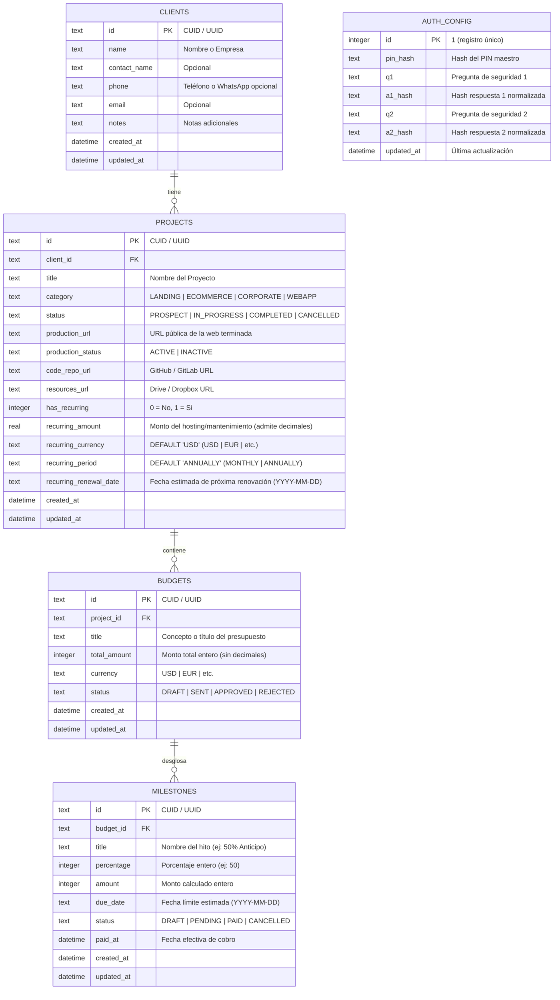

# 🏗️ Couvance Ops — Especificación Técnica y Arquitectura del Sistema

> **Documento de Arquitectura y Stack Tecnológico:** Especificación técnica detallada para el desarrollo y despliegue del MVP de **Couvance Ops**, diseñado como un monolito modular fullstack en TypeScript de alto rendimiento y costo de infraestructura $0 sobre el ecosistema de Cloudflare.

---

## 🎯 1. Resumen de Decisiones Técnicas y Racional de Diseño

| Componente | Elección Técnica | Justificación & Valor en Portafolio |
| :--- | :--- | :--- |
| **Arquitectura** | Monolito Modular Fullstack | Un solo repositorio con separación nítida entre API REST (Backend) e interfaz interactiva (SPA), facilitando el desarrollo ágil para 2 socios. |
| **Runtime & Servidor Backend** | **Hono** (TypeScript) sobre **Cloudflare Workers / Pages Functions** | El sucesor moderno de Express: sintaxis familiar (`app.get`, `app.post`, middlewares), peso ultraligero (<15 KB), tipado estricto y ejecución nativa en el Edge. |
| **Frontend & UI** | **React (Vite) + TypeScript** | SPA ultrarrápida sin recargas de página; reactividad fluida para modales, filtros instantáneos del Showcase y cálculos en tiempo real. |
| **Primitivas de UI (Headless)** | **Radix UI Primitives** | Accesibilidad completa y lógica de modales/diálogos sin ningún estilo prefabricado, dando 100% de libertad de diseño y cero "AI slop". |
| **Estilos & Layout** | **Tailwind CSS** | Control estético total, diseño responsivo móvil/escritorio, rendimiento óptimo con CSS compilado y transiciones nativas puras (sin librerías pesadas como Framer Motion). |
| **Notificaciones (Toasts)** | **Sonner** | Notificaciones flotantes minimalistas y elegantes para avisos de copiado al portapapeles y confirmaciones de pago. |
| **Iconografía** | **Lucide React** | Iconos limpios, consistentes y ligeros con carga por componentes individuales. |
| **Base de Datos** | **Cloudflare D1 (SQLite Serverless)** | Base de datos relacional SQL serverless nativa en Cloudflare. 5 millones de lecturas/día y 5 GB de almacenamiento gratuitos ($0 costo operativo). |
| **ORM & Migraciones** | **Drizzle ORM + Drizzle Kit** | Máxima velocidad, SQL tipado en TypeScript sin binarios pesados (a diferencia de Prisma), diseñado para Edge runtimes. |
| **Validación de Datos** | **Zod** | Esquemas de validación compartidos entre cliente y servidor, asegurando que ningún dato inconsistente toque la base de datos. |
| **Seguridad de Acceso** | **PIN Maestro de 6 Dígitos (D1 Persistente)** | Almacenamiento de hash y preguntas de seguridad en tabla `AUTH_CONFIG` de D1 (permite reseteo mutable en Edge), cookie `HttpOnly` / `Secure` / `SameSite=Lax` (soporte WhatsApp móvil), rate limiting (5 intentos/15 min) y token firmado con `PIN_SECRET`. |
| **Hosting & Dominio** | **Cloudflare Pages** (`ops.couvance.com`) | Despliegue continuo con Git en el dominio ya configurado de la agencia (`couvance.com`) a costo $0. |
| **Contenerización & Portabilidad** | **Docker & Docker Compose** | Arquitectura agnóstica de runtime: ejecución en un solo contenedor ligero (<100 MB RAM) con Node/Bun y SQLite local persistido en volumen. |

---

## 🏛️ 2. Diagrama de Arquitectura del Sistema

```mermaid
graph TD
    User["Socio (Móvil / Escritorio)"] -->|HTTPS / ops.couvance.com| CF["Cloudflare Edge Network"]
    
    subgraph Cloudflare Pages
        CF --> Static["Frontend (React + Vite SPA)"]
        CF --> API["Backend Functions (Hono API Router)"]
        
        subgraph Capa de Seguridad & Middlewares
            API --> AuthMW["PIN Auth Middleware (Cookie HMAC/JWT)"]
            API --> ValMW["Zod Validation Middleware"]
        end
        
        subgraph Capa de Negocio (Hono Services)
            AuthMW --> ClientSvc["Client Service"]
            AuthMW --> ProjectSvc["Project & Showcase Service"]
            AuthMW --> BudgetSvc["Budget & Milestone Service"]
            AuthMW --> BackupSvc["Backup Export Service"]
        end
        
        subgraph Capa de Datos (Drizzle ORM)
            ClientSvc --> Drizzle["Drizzle ORM Client"]
            ProjectSvc --> Drizzle
            BudgetSvc --> Drizzle
            BackupSvc --> Drizzle
        end
    end
    
    subgraph Persistencia
        Drizzle --> D1["Cloudflare D1 (SQLite Database)"]
    end
```

### 2.1 Filosofía de Interfaz: Rendimiento Ultraligero y Diseño de Autor (Anti-"AI Slop")
Para garantizar una estética moderna con identidad propia sin sobrecargar el bundle de JavaScript:
* **Primitivas Headless con Radix UI:** Se utilizan componentes sin estilos para diálogos (`Dialog`), menús desplegables (`DropdownMenu`), pestañas (`Tabs`) y tooltips. Radix aporta la accesibilidad (WAI-ARIA), el control de teclado y el montaje en el DOM, mientras que el 100% del estilo visual lo controla el desarrollador con Tailwind CSS.
* **Cero Librerías Pesadas de Animación:** Se descartan conscientemente dependencias pesadas como Framer Motion (~30 KB+ gzipped) para mantener la app ligera y ágil en móviles. Las transiciones de estados, modales y hover se manejan con **CSS nativo acelerado por hardware a través de utilidades de Tailwind** (`transition-all duration-150 ease-out`).
* **Feedback Minimalista con Sonner:** Notificaciones toast ultraligeras, elegantes y no invasivas para confirmar acciones críticas (hitos cobrados, enlaces y resúmenes copiados al portapapeles).
* **Jerarquía Editorial y Bordes Sutiles:** En lugar de sombras pesadas o gradientes genéricos, la interfaz se basa en bordes finos de 1px (`border-neutral-800`), paleta neutra de alto contraste, tipografía sans/mono limpia y layout denso/ordenado optimizado para la velocidad operativa de la agencia.

---

## 🗄️ 3. Modelo Físico de Datos (Esquema Drizzle / SQLite)

El esquema relacional refleja con precisión las reglas de negocio acordadas: persistencia de credenciales y preguntas de recuperación en `AUTH_CONFIG`, montos enteros para proyectos/hitos, moneda y periodicidad configurables en recurrentes, ciclo de vida completo de hitos (`DRAFT | PENDING | PAID | CANCELLED`) y preservación de proyectos cancelados.



---

## 🔒 4. Arquitectura de Seguridad: Autenticación en D1, Cookie Lax y Rate Limiting

Para garantizar cero fricción sin comprometer la privacidad frente a terceros en la web:

1. **Persistencia de Credenciales en D1 (`AUTH_CONFIG`) y Función de Hash Nativa:**
   - En Cloudflare Workers / Pages Functions, las variables de entorno son de solo lectura en tiempo de ejecución (`read-only at runtime`). Por tanto, para habilitar la actualización y reseteo del PIN en caliente sin requerir redespliegues del proyecto, el hash del PIN y las preguntas/respuestas secretas se almacenan en la tabla `AUTH_CONFIG` de Cloudflare D1 (`id`, `pin_hash`, `q1`, `a1_hash`, `q2`, `a2_hash`, `updated_at`).
   - La variable de entorno inmutable `PIN_SECRET` se mantiene en Cloudflare Pages como secreto para la firma y verificación criptográfica (HMAC / JWT) de las cookies de sesión y como *salt/pepper* de hash.
   - **Algoritmo de Hash Nativo (Zero Dependencies):** Se utiliza SHA-256 nativo mediante la API estándar de la plataforma (`crypto.subtle.digest` en Cloudflare Edge o `crypto.createHash('sha256')` en Node) combinando el valor de entrada con `PIN_SECRET`: `hash = sha256(input + PIN_SECRET)`. Esto descarta dependencias externas con binarios en C++ (como `bcrypt` o `argon2`) garantizando compatibilidad 100% inmediata y ejecución ultrarrápida (<1 ms) tanto en Cloudflare Edge como en Docker.

2. **Autenticación y Propiedades de la Cookie:**
   - El endpoint `POST /api/auth/unlock` valida el PIN contra `AUTH_CONFIG.pin_hash`. Si coincide, emite una Cookie segura con un token de sesión firmado.
   - **Configuración de la Cookie:** `HttpOnly=true`, `Secure=true`, `SameSite=Lax`, con expiración prolongada (ej. 30 días). Se define estrictamente `SameSite=Lax` (en vez de `Strict`) para garantizar la compatibilidad móvil (RNF-01), permitiendo que la cookie de sesión viaje en navegaciones de nivel superior cuando un socio abre enlaces compartidos directamente desde WhatsApp sin provocar bloqueos inesperados.

3. **Protección Anti-Fuerza Bruta Pragmática (Rate Limiting en Memoria):**
   - Se implementa un middleware de rate limiting ligero en memoria sobre las rutas bajo `/api/auth/*` (`src/server/middlewares/rate-limit.ts`).
   - Restringe el tráfico a un máximo de **5 intentos fallidos por ventana de 15 minutos por dirección IP** (obteniendo la IP mediante `c.req.header('cf-connecting-ip') || c.req.header('x-forwarded-for') || '127.0.0.1'`). Al superar el límite, responde inmediatamente con código `429 Too Many Requests`. Para el contexto privado de 2 socios en un subdominio no indexado, esta defensa en memoria es liviana, autónoma y suficiente para frenar pruebas involuntarias o sondeos rápidos sin sobrecargar la infraestructura.

4. **Middleware de Protección de Rutas (`pinAuthMiddleware`):**
   - Todo endpoint bajo `/api/*` requiere pasar por `pinAuthMiddleware`, el cual verifica la firma y vigencia del token de la cookie de sesión. Si la cookie falta o el token es inválido, retorna `401 Unauthorized`.
   - **Rutas Públicas Exentas:** Se excluyen explícitamente de la validación de `pinAuthMiddleware` únicamente las siguientes rutas:
     - `POST /api/auth/unlock`
     - `GET /api/auth/questions`
     - `POST /api/auth/recover`
     - `POST /api/auth/reset-pin`
     - `GET /api/health`

5. **Flujo de Recuperación y Reseteo de PIN:**
   - **Consulta de Preguntas:** El frontend consulta de manera pública `GET /api/auth/questions`, obteniendo `{ q1, q2 }` sin exponer los hashes de respuesta.
   - **Validación de Respuestas:** El socio envía sus respuestas a `POST /api/auth/recover`. El servicio normaliza el texto (minúsculas, trim), calcula su hash y lo compara contra `a1_hash` y `a2_hash` en `AUTH_CONFIG`. Si coinciden, emite un token de recuperación temporal de corta duración (10 minutos) firmado con `PIN_SECRET`.
   - **Actualización de PIN:** Con el token temporal, el socio llama a `POST /api/auth/reset-pin` indicando el nuevo PIN de 6 dígitos. El endpoint valida el token, genera el nuevo hash y actualiza atómicamente `AUTH_CONFIG.pin_hash` y `AUTH_CONFIG.updated_at` en D1, emitiendo de inmediato la cookie de sesión autenticada.

---

## 📡 5. Diseño de Endpoints de la API (Hono API Routes)

### Autenticación y Acceso
* `POST /api/auth/unlock` — Valida el PIN de 6 dígitos contra `AUTH_CONFIG.pin_hash` en D1 y entrega la cookie de sesión recordada (`HttpOnly`, `Secure`, `SameSite=Lax`). Sujeto a rate limiting (máx. 5 intentos fallidos / 15 min).
* `GET /api/auth/questions` — Retorna `{ q1: string, q2: string }` de forma pública (sin autenticación) desde `AUTH_CONFIG` para que la UI renderice las preguntas de recuperación.
* `POST /api/auth/recover` — Valida las respuestas a las preguntas secretas contra `a1_hash` y `a2_hash` en `AUTH_CONFIG`. Si coinciden, emite un token temporal de reseteo (validez 10 minutos). Sujeto a rate limiting.
* `POST /api/auth/reset-pin` — Valida el token temporal emitido por `/api/auth/recover` y actualiza `pin_hash` y `updated_at` en `AUTH_CONFIG` en D1 atómicamente, emitiendo la nueva cookie de sesión.
* `POST /api/auth/lock` — Cierra la sesión activa en el navegador (borra e invalida la cookie).
* *(Rutas públicas exentas de `pinAuthMiddleware`: `/api/auth/unlock`, `/api/auth/questions`, `/api/auth/recover`, `/api/auth/reset-pin`, `/api/health`)*.

### Clientes
* `GET /api/clients` — Lista de clientes con sus proyectos y saldos asociados.
* `POST /api/clients` — Creación de cliente (valida con Zod: nombre obligatorio, resto opcional).
* `PUT /api/clients/:id` — Edición de datos o notas de contacto.
* `DELETE /api/clients/:id` — Eliminación de cliente: solo se permite la eliminación si posee `COUNT(projects) === 0`. Retorna `409 Conflict` si existen proyectos asociados (activos, terminados o cancelados) para salvaguardar el histórico contable y el showcase.

### Proyectos & Showcase
* `GET /api/projects` — Listado general con filtros por estado (`PROSPECT`, `IN_PROGRESS`, `COMPLETED`, `CANCELLED`).
* `GET /api/projects/:id` — Consulta detallada del proyecto con información del cliente, presupuestos e hitos asociados.
* `POST /api/projects` — Creación de proyecto asociado a cliente con categoría, enlaces opcionales y datos de recurrencia (`recurring_amount`, `recurring_currency`, `recurring_period`, `recurring_renewal_date`).
* `PUT /api/projects/:id` — Actualización de estado, URLs (Producción, Repositorio, Drive) y datos de hosting/mantenimiento. **Cancelación:** Al cambiar el estado a `CANCELLED`, actualiza de forma atómica (vía `db.batch` en D1 o secuencial) todos los hitos del proyecto con estado `PENDING` a `CANCELLED`, conservando intactos los hitos con estado `PAID` (preservando el histórico contable).
* `GET /api/showcase` — Consulta rápida y optimizada para el portafolio de ventas: proyectos en estado `COMPLETED` con web en producción activa (`production_status = 'ACTIVE'`), filtrables por categoría.

### Presupuestos e Hitos
* `POST /api/projects/:id/budgets` — Creación de presupuesto con desglose de hitos en estado inicial `DRAFT`. Valida la regla del 100% en porcentajes y concordancia de monto total. En montos que arrojen centavos al dividir (ej: 30% de $1,005 = $301.50), los hitos se redondean a enteros y el último hito absorbe automáticamente la diferencia para que la suma cuadre exactamente.
* `GET /api/projects/:id/budgets` — Historial de presupuestos e hitos del proyecto.
* `PUT /api/budgets/:id` — Edición de presupuesto e hitos mientras se encuentre en estado `DRAFT`.
* `POST /api/budgets/:id/approve` — **Aprobación en 1 Clic:** Cambia presupuesto a `APPROVED`, proyecto a `IN_PROGRESS` y promueve sus hitos de `DRAFT` a `PENDING` (mediante `db.batch` en D1 o ejecución secuencial directa sin necesidad de transacciones interactivas complejas).
* `POST /api/budgets/:id/reject` — Marca el presupuesto como rechazado (`REJECTED`).

### Cobranza y Finanzas
* `PATCH /api/milestones/:id/pay` — Marca un hito como `PAID` con la fecha actual (`paid_at = datetime('now')`).
* `POST /api/budgets/:id/pay-all` — **Cobro Express:** Marca todos los hitos pendientes (`PENDING`) del presupuesto como `PAID` simultáneamente con la fecha actual.
* `GET /api/finance/radar` — Listado unificado de cobranza:
  1. Hitos de proyectos consultados estrictamente con `WHERE status = 'PENDING'` ordenados por `due_date ASC`. Incluye en su DTO proyectado: `client_name`, `client_phone`, `project_title`, `currency`, `amount`, `percentage` y `due_date` para soportar el flujo WhatsApp (`wa.me`) con fallback de copia al portapapeles.
  2. Proyectos con servicio recurrente (`has_recurring = 1`) y renovación estimada a menos de 30 días, proyectando `client_name`, `client_phone`, `project_title`, `recurring_amount`, `recurring_currency` y `recurring_renewal_date`.
* `POST /api/projects/:id/renew` — Avanza la fecha de renovación (`recurring_renewal_date`) según `recurring_period` (`MONTHLY`: +1 mes, `ANNUALLY`: +1 año) tras registrar el cobro del hosting/mantenimiento recurrente.
* `GET /api/finance/metrics` — Métricas globales: Total en la calle (suma de hitos `PENDING`), Total cobrado histórico (suma de hitos `PAID`), Saldo pendiente por cobrar.

### Respaldo de Datos
* `GET /api/backup/export` — Genera y descarga un archivo `.json` estructurado con la copia completa de las entidades operativas del negocio (`CLIENTS`, `PROJECTS`, `BUDGETS`, `MILESTONES`), excluyendo deliberadamente `AUTH_CONFIG` para garantizar que ninguna credencial o hash viaje en archivos locales de respaldo.

### Salud y Diagnóstico
* `GET /api/health` — Endpoint público de sondeo y diagnóstico sin autenticación para Docker healthcheck y monitoreo de uptime. Retorna `{ status: "ok", runtime: "node" | "cloudflare", uptime: number, timestamp: string }`.

---

## 📂 6. Estructura de Directorios del Monolito

```text
couvance-ops/
├── drizzle/                    # Migraciones SQL generadas por Drizzle Kit
│   └── 0000_init.sql
├── functions/                  # Adaptador nativo Cloudflare Pages Functions (cero fricción)
│   └── api/
│       └── [[route]].ts        # export const onRequest = handle(app);
├── src/
│   ├── server/                 # BACKEND CON HONO
│   │   ├── db/
│   │   │   ├── schema.ts       # Definición de tablas Drizzle (AuthConfig, Clients, Projects, Budgets, Milestones)
│   │   │   ├── d1.ts           # Conexión Cloudflare D1 (drizzle-orm/d1)
│   │   │   ├── sqlite.ts       # Conexión local Node / better-sqlite3 (drizzle-orm/better-sqlite3)
│   │   │   └── index.ts        # Selector / factoría agnóstica de base de datos según runtime
│   │   ├── middlewares/
│   │   │   ├── auth.ts         # Middleware de validación de PIN y cookie de sesión (con exención de rutas públicas)
│   │   │   └── rate-limit.ts   # Middleware de rate limiting (5 intentos fallidos / 15 min en /api/auth/*)
│   │   ├── modules/
│   │   │   ├── auth/           # Rutas y servicios: unlock, questions, recover, reset-pin y lock
│   │   │   ├── clients/        # Lógica de clientes y validación Zod (protección 409 con proyectos vinculados)
│   │   │   ├── projects/       # Lógica de proyectos, catálogo showcase y cancelación atómica de hitos
│   │   │   ├── budgets/        # Presupuestos, hitos (ciclo DRAFT -> PENDING -> PAID/CANCELLED)
│   │   │   ├── finance/        # Radar de cobros con DTO WhatsApp, renovaciones recurrentes y métricas
│   │   │   └── backup/         # Generador de volcado estructurado a JSON
│   │   ├── app.ts              # Instancia principal de Hono con rutas y middlewares (compartida)
│   │   ├── node-entry.ts       # Entrypoint autónomo para Node.js / Docker con migraciones y static serving
│   │   └── index.ts            # Entrypoint de exportación para Cloudflare Pages Functions
│   │
│   └── client/                 # FRONTEND CON REACT + VITE
│       ├── src/
│       │   ├── components/     # Componentes UI (Navbar, Modales, Botones de WhatsApp, Teclado PIN)
│       │   ├── hooks/          # Hooks para llamadas a la API y estado
│       │   ├── pages/
│       │   │   ├── Dashboard.tsx   # Radar de cobros y métricas clave
│       │   │   ├── Projects.tsx    # Gestión de proyectos y cotizaciones
│       │   │   ├── Showcase.tsx    # Catálogo de ventas filtrable por categoría
│       │   │   ├── Clients.tsx     # Directorio de clientes
│       │   │   └── Unlock.tsx      # Teclado numérico para ingresar el PIN de 6 dígitos
│       │   ├── lib/
│       │   │   ├── utils.ts        # Helper para generar enlaces wa.me y copiar portapapeles
│       │   │   └── api.ts          # Cliente API tipado
│       │   ├── App.tsx
│       │   └── main.tsx
│       ├── index.html
│       └── vite.config.ts
│
├── Dockerfile                  # Multi-stage build para empaquetado autónomo
├── docker-compose.yml          # Orquestación con volumen persistente SQLite
├── .dockerignore               # Exclusiones de build para imágenes ligeras
├── wrangler.toml               # Configuración de Cloudflare Pages y binding de D1
├── drizzle.config.ts           # Configuración de migraciones Drizzle
├── package.json
├── tsconfig.json
└── README.md
```

---

## ⚡ 7. Estrategia de Despliegue en Cloudflare ($0 Costo)

1. **Configuración en Cloudflare Dashboard:**
   * Crear base de datos D1: `npx wrangler d1 create couvance-ops-db`.
   * Enlazar el binding de D1 en `wrangler.toml`:
     ```toml
     [[d1_databases]]
     binding = "DB"
     database_name = "couvance-ops-db"
     database_id = "<tu-database-id>"
     ```
2. **Subdominio Personalizado:**
   * En el panel de Cloudflare DNS de `couvance.com`, asociar el subdominio `ops.couvance.com` al proyecto de Cloudflare Pages.
3. **Variables de Entorno y Migraciones en D1:**
   * **Variable de Entorno (Cloudflare Pages):** Configurar `PIN_SECRET` (clave criptográfica para la firma de tokens JWT y salado de hashes).
   * **Aplicar Migraciones SQL:**
     - En local (emulador): `npx wrangler d1 migrations apply couvance-ops-db --local`
     - En producción: `npx wrangler d1 migrations apply couvance-ops-db --remote`
   * **Integración Nativa Pages Functions:** Cloudflare Pages detecta de forma automática la carpeta `functions/api/[[route]].ts`, la cual con tan solo 3 líneas (`import { handle } from 'hono/cloudflare-pages'; import app from '../../src/server/app'; export const onRequest = handle(app);`) monta de inmediato todos los endpoints del backend sobre el Edge sin requerir pasos complejos de build.
4. **Pipeline CI/CD:**
   * Cada `git push` a la rama `main` ejecuta el build de Vite (`npm run build:client`) y Cloudflare Pages publica la SPA y monta las Pages Functions en segundos de forma automática.

---

## 🐳 8. Contenerización con Docker y Portabilidad Multi-Runtime

Para maximizar la versatilidad técnica del proyecto y evitar el *vendor lock-in*, **Couvance Ops** cuenta con una arquitectura de ejecución dual:
1. **Cloudflare Edge ($0 Costo en Producción):** Despliegue serverless sobre Cloudflare Pages + D1.
2. **Contenedor Autónomo Docker (Desarrollo Local / VPS Privado):** Ejecución como servidor Node.js autónomo mediante `@hono/node-server` y base de datos SQLite embebida en disco local persistido.

### 8.1 Abstracción de Base de Datos Multi-Driver y Entrypoint Autónomo (Node.js)

Para soportar ambos entornos sin duplicar lógica de negocio, se aísla la conexión de datos y se utiliza un entrypoint dedicado para Node.js:
* **Cloudflare D1 (`src/server/db/d1.ts`):** Inicializa `drizzle-orm/d1` utilizando el binding serverless `c.env.DB`.
* **Node SQLite (`src/server/db/sqlite.ts`):** Inicializa `better-sqlite3` con `drizzle-orm/better-sqlite3` apuntando al volumen `/app/data/couvance-ops.db`.
* **Selector Agnóstico (`src/server/db/index.ts`):** Factoría que entrega la instancia correcta según las variables de entorno de ejecución.

#### Entrypoint Autónomo: `src/server/node-entry.ts`
Este archivo encapsula la inicialización de SQLite con `better-sqlite3`, la ejecución automática de migraciones Drizzle en el arranque (`migrate`), el sembrado inicial si la tabla `AUTH_CONFIG` está vacía, el endpoint de diagnóstico `/api/health`, el servicio de archivos estáticos para la SPA de React con fallback SPA History API, y el arranque de `@hono/node-server`:

```typescript
import { serve } from '@hono/node-server';
import { serveStatic } from '@hono/node-server/serve-static';
import Database from 'better-sqlite3';
import { drizzle } from 'drizzle-orm/better-sqlite3';
import { migrate } from 'drizzle-orm/better-sqlite3/migrator';
import { eq } from 'drizzle-orm';
import crypto from 'node:crypto';
import app from './app'; // Instancia principal de Hono con rutas y middlewares
import { authConfig } from './db/schema';

// Helper nativo para hash pragmático sin dependencias externas
const hashValue = (val: string) =>
  crypto.createHash('sha256').update(val.trim().toLowerCase() + (process.env.PIN_SECRET || 'default_secret')).digest('hex');

// 1. Inicialización y conexión de SQLite local (better-sqlite3)
const dbPath = process.env.DATABASE_URL?.replace('file:', '') || '/app/data/couvance-ops.db';
const sqlite = new Database(dbPath);
sqlite.pragma('journal_mode = WAL');
sqlite.pragma('foreign_keys = ON');
const db = drizzle(sqlite);

// 2. Ejecución automática de migraciones Drizzle en el arranque
try {
  console.log('🔄 Ejecutando migraciones Drizzle en SQLite local...');
  migrate(db, { migrationsFolder: './drizzle' });
  console.log('✅ Migraciones Drizzle aplicadas exitosamente.');

  // Sembrado inicial (seed) si la tabla AUTH_CONFIG está vacía
  const existingAuth = db.select().from(authConfig).where(eq(authConfig.id, 1)).get();
  if (!existingAuth) {
    const initialPin = process.env.INITIAL_PIN || '123456';
    const q1 = process.env.SECURITY_Q1 || '¿Cuál es el nombre de tu primera mascota?';
    const a1 = process.env.SECURITY_A1 || 'couvance';
    const q2 = process.env.SECURITY_Q2 || '¿En qué ciudad se fundó la agencia?';
    const a2 = process.env.SECURITY_A2 || 'valencia';

    db.insert(authConfig).values({
      id: 1,
      pinHash: hashValue(initialPin),
      q1,
      a1Hash: hashValue(a1),
      q2,
      a2Hash: hashValue(a2),
      updatedAt: new Date().toISOString(),
    }).run();
    console.log('🌱 Credenciales maestras iniciales sembradas en AUTH_CONFIG.');
  }
} catch (error) {
  console.error('❌ Error aplicando migraciones o sembrado inicial en SQLite:', error);
  process.exit(1);
}

// Inyección de la base de datos en el contexto de Hono
app.use('*', async (c, next) => {
  c.set('db', db);
  await next();
});

// 3. Endpoint de diagnóstico y salud del sistema para Docker healthcheck
app.get('/api/health', (c) => {
  return c.json({
    status: 'ok',
    runtime: 'node',
    uptime: process.uptime(),
    timestamp: new Date().toISOString(),
  });
});

// 4. Servicio de assets estáticos compilados de React (SPA)
app.use('/*', serveStatic({ root: './dist/client' }));
// Fallback para React Router / SPA History API
app.get('*', serveStatic({ path: './dist/client/index.html' }));

// 5. Arranque del servidor con @hono/node-server
const port = Number(process.env.PORT) || 3000;
console.log(`🚀 Servidor Couvance Ops escuchando en http://0.0.0.0:${port}`);
serve({
  fetch: app.fetch,
  port,
  hostname: '0.0.0.0',
});
```

#### Pipeline de Compilación Dual (`package.json`)
Para compilar la SPA de React con Vite y el servidor Node.js autónomo en JavaScript ESM puro, se define un pipeline de build desacoplado. El bundle del servidor marca `better-sqlite3` como dependencia externa (`--external`), ya que contiene binarios compilados en C++ nativos en `node_modules`:

```json
{
  "scripts": {
    "dev": "vite",
    "dev:server": "tsx watch src/server/node-entry.ts",
    "build:client": "vite build --outDir dist/client",
    "build:server": "tsup src/server/node-entry.ts --format esm --out-dir dist/server --external better-sqlite3",
    "build": "npm run build:client && npm run build:server",
    "db:generate": "drizzle-kit generate",
    "db:migrate:local": "wrangler d1 migrations apply couvance-ops-db --local",
    "db:migrate:prod": "wrangler d1 migrations apply couvance-ops-db --remote",
    "start": "node dist/server/node-entry.js"
  }
}
```

### 8.2 Dockerfile Multi-Stage de Producción (`node:20-slim`)
Se utiliza `node:20-slim` (Debian glibc) en lugar de Alpine musl para garantizar compatibilidad binaria 100% estable con `better-sqlite3` sin errores de compilación de toolchains nativas de C++, manteniendo la imagen final por debajo de 150 MB.

```dockerfile
# ==========================================
# Stage 1: Builder
# ==========================================
FROM node:20-slim AS builder
WORKDIR /app

# Instalar herramientas para compilar módulos nativos (better-sqlite3)
RUN apt-get update && apt-get install -y --no-install-recommends \
    python3 \
    make \
    g++ \
    && rm -rf /var/lib/apt/lists/*

COPY package*.json tsconfig*.json ./
RUN npm ci

COPY . .

# Compila el cliente SPA a dist/client y el servidor Node a dist/server
RUN npm run build

# Poda dependencias de desarrollo conservando únicamente las de producción
RUN npm prune --omit=dev

# ==========================================
# Stage 2: Runner de Producción
# ==========================================
FROM node:20-slim AS runner
WORKDIR /app

ENV NODE_ENV=production
ENV PORT=3000

# Copiar manifiestos y dependencias de producción ya podadas
COPY package*.json ./
COPY --from=builder /app/node_modules ./node_modules

# Copiar artefactos de compilación (dist/client y dist/server)
COPY --from=builder /app/dist ./dist

# CRÍTICO: Copiar archivos de migraciones SQL para ejecución automática en arranque
COPY --from=builder /app/drizzle ./drizzle

# Crear directorio de persistencia SQLite y asignar permisos al usuario no root node
RUN mkdir -p /app/data && chown -R node:node /app/data

# Ejecutar como usuario no privilegiado
USER node

EXPOSE 3000
VOLUME ["/app/data"]

CMD ["node", "dist/server/node-entry.js"]
```

### 8.3 Orquestación con Docker Compose Modernizado
El archivo `docker-compose.yml` adopta el estándar actual de Compose Specification (sin atributo obsoleto `version`), utiliza un volumen nombrado `couvance_data` para evitar problemas de permisos de usuario (`root:root`) en la máquina host, e incorpora un mecanismo nativo de `healthcheck` sin dependencias externas (`curl`/`wget`):

```yaml
services:
  couvance-ops:
    build: .
    container_name: couvance-ops
    restart: unless-stopped
    ports:
      - "3000:3000"
    environment:
      - PORT=3000
      - NODE_ENV=production
      - PIN_SECRET=clave_secreta_super_segura_para_jwt
      - DATABASE_URL=file:/app/data/couvance-ops.db
      - INITIAL_PIN=123456
      - SECURITY_Q1=¿Cuál es el nombre de tu primera mascota?
      - SECURITY_A1=couvance
      - SECURITY_Q2=¿En qué ciudad se fundó la agencia?
      - SECURITY_A2=valencia
    volumes:
      - couvance_data:/app/data
    healthcheck:
      test: ["CMD", "node", "-e", "fetch('http://127.0.0.1:3000/api/health').then(r => r.ok ? process.exit(0) : process.exit(1)).catch(() => process.exit(1))"]
      interval: 30s
      timeout: 5s
      retries: 3
      start_period: 10s

volumes:
  couvance_data:
```

### 8.4 Ventajas para el Portafolio y Operación:
* **Un solo contenedor para todo el stack:** Al usar SQLite embebido con `better-sqlite3`, no se requiere un contenedor secundario de PostgreSQL o MySQL; el consumo de RAM en reposo es inferior a 80 MB y el tamaño de la imagen final es inferior a 150 MB.
* **Arranque instantáneo en local:** Cualquier desarrollador o evaluador técnico puede clonar el repositorio y ejecutar `docker compose up -d` para probar la aplicación completa con migraciones automáticas, sembrado inicial y datos locales sin configurar cuentas de Cloudflare.
* **Persistencia segura y permisos limpios:** El volumen administrado `couvance_data:/app/data` garantiza que los datos y cotizaciones no se pierdan al reiniciar o actualizar el contenedor, eliminando riesgos de bloqueos por permisos `root` del host.
* **Resiliencia y Diagnóstico en Producción:** El contenedor reporta su estado de salud (`healthy`) vía el endpoint `/api/health`, permitiendo la autorrecuperación automática ante fallos de proceso en cualquier orquestador (Docker Compose, Docker Swarm o Kubernetes).
